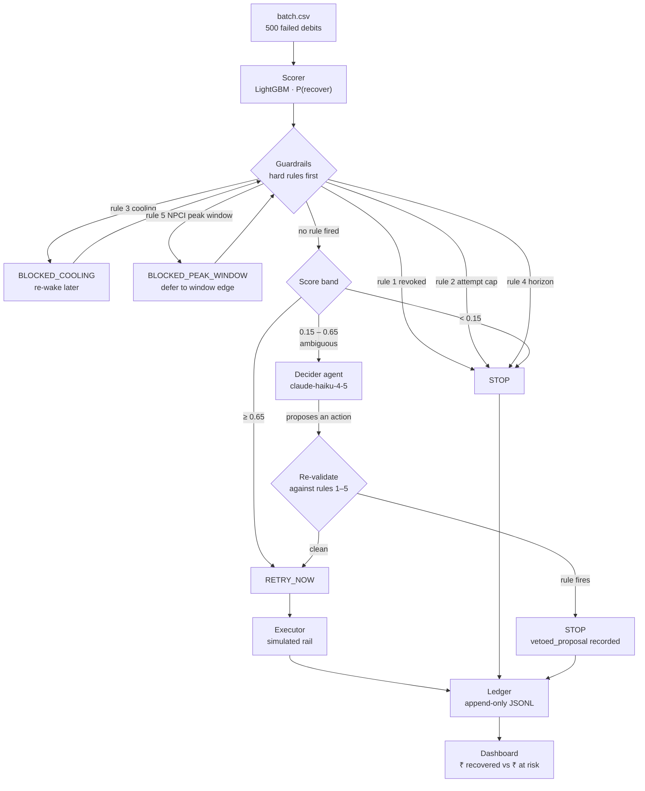

# Architecture

How the Mandate Retry Sequencer works, for an engineer who has not seen the repo before.

The contract it is built against is [SPEC.md](SPEC.md); where this document and SPEC disagree,
SPEC is right and this one is stale. Every design reversal is recorded in SPEC rather than quietly
fixed, so the history of what was tried and discarded is readable.

---

## 1. The problem, precisely

A UPI Autopay mandate debit fails. Something should happen next: retry now, retry later, ask the
customer for a promise to pay, or stop. Doing nothing loses recoverable revenue. Retrying blindly
burns attempts against a regulatory cap, costs money per attempt, and annoys customers who were
never going to pay this cycle.

The interesting part is not prediction. It is that **some of these records must never be retried at
all**, regardless of how recoverable a model thinks they are. A revoked mandate has no authority
behind it. A record on its fourth attempt has exhausted its cycle. Those are compliance facts, not
probabilities, and a system that lets a confident score talk it into a retry is not shippable in
payments.

So the system is built as a **deterministic spine with a narrow model-driven segment**, not as a
model with rules bolted on.

---

## 2. The pipeline



A 14-day simulated clock steps the whole thing in one-hour ticks. Records wake when they are due —
initially, when a cooling period expires, when an NPCI peak window closes, when a booked retry
comes round, or when a promise falls due — and every wake produces exactly one ledger row.

The clock is not decoration. Without it, "attempts per recovery" is not a distribution and rules 3
and 5 are assertions rather than demonstrated behaviour: a record blocked at hour 3 has to actually
come back at hour 27 and succeed or fail on its own merits, and one that comes due at 11:00 has to
actually wait until 13:00. On the current batch that is 38 peak deferrals, and a test asserts that
none of the 266 debits landed inside a restricted window.

---

## 3. Why the scorer and the guardrails are separate layers

The scorer answers *how likely is this to recover*. The guardrails answer *what are we permitted to
do about it*. Those are different questions with different failure modes, and collapsing them into
one model is the mistake this design exists to avoid.

Three properties follow from keeping them apart:

**A hard rule cannot be outvoted.** `guardrails.evaluate()` checks rules 1–5 *before* it looks at
the score at all. A revoked mandate scoring 0.99 returns `STOP`, and there is no code path that
reaches the score bands afterwards. These are tests, not claims —
`test_rule1_revoked_mandate_stops_even_at_score_099`,
`test_rule2_attempt_cap_stops_even_at_score_099`, and `test_rule3_cooling_beats_a_high_score` in
`backend/tests/test_guardrails.py`.

**The agent's output is a proposal, not an authority.** The agent is consulted only inside
`0.15 ≤ score < 0.65`, and only for records where no rule fired. Whatever it returns goes back
through `guardrails.validate_proposal()` before anything executes. If a rule fires on
re-validation, the action becomes `STOP` and the ledger row carries `vetoed_proposal` naming what
was refused. The runner is structured so it *cannot* execute an action that did not come back out
of that function.

**The pipeline closes without the agent.** `decide_fallback()` is a pure function covering the same
band. With `use_llm=false`, no API key, or an empty cache, the whole campaign runs and produces a
real rupee figure. The agent is an upgrade to a working system, never a dependency of one — which
is also what makes the ablation in §7 meaningful.

On the current batch, 11 records carry a vetoed proposal. Each one is an agent-booked retry whose
window arrived after the campaign horizon had closed, so rule 4 refused it. Nothing about those
rows is seeded; they fall out of the clock.

---

## 4. The NPCI constraints — read this before citing any of it

Five constants drive the hard rules, and they are **not equally trustworthy**. Grading them as if
they were would be the actual failure in a payments review:

| Constant | Value | Tier | Basis |
|---|---|---|---|
| `MAX_ATTEMPTS` | 4 (1 original + 3 retries) | **1 — regulation** | NPCI guidelines notified 21 May 2025, effective 1 Aug 2025 |
| `PEAK_WINDOWS_IST` | blocked 10:00–13:00, 17:00–21:30 | **1 — regulation** | same document; sources quote the hours verbatim |
| `RETRY_WINDOWS_HOURS` | 24 / 72 / 168 | **2 — convention** | widely used best practice, **not** an NPCI mandate |
| `COOLING_PERIOD_HOURS` | 24 | **3 — assumption** | no source located |
| `HORIZON_DAYS` | 14 | **3 — design choice** | not a rule at all |

**Nothing here was read from the primary circular.** `npci.org.in` blocks automated fetches, so even
the tier-1 claims are second-hand from multiple independent reports that agree on specifics.

An earlier revision listed the retry ladder as corroborated regulation. It is not — one source says
explicitly that those intervals are recommended practice rather than mandated. The over-claim is
corrected and the correction is left in the git history, because that is the failure mode this
tiering exists to prevent and hiding it would defeat the point.

Full citations, exact quotes, and a section on what would change my mind: [SOURCES.md](SOURCES.md).
Everything lives in exactly one file, `policy.py`, and nothing else in the codebase restates it.

---

## 5. The ledger, and why append-only

`data/ledger.jsonl`. One row per decision, written once, never rewritten. A correction is a new row.

Each row carries the input snapshot, the score, which rules fired, the action taken, the retry delay
if any, which layer decided it (`live` / `cache` / `fallback` / `deterministic`), the agent's
one-sentence reasoning, the outcome, and the money — in integer paise.

Append-only is what makes the dashboard defensible. Every rupee on screen traces to a row describing
a decision that actually happened, and no later state change can rewrite what the system believed at
the time. `Ledger.append()` raises on a duplicate `(row_id, attempt_number, sim_ts)` rather than
overwriting, because a silently doubled row is a silently doubled rupee.

**Money is integer paise everywhere.** A float never touches a currency value, from the generator
through to the API response. Formatting to rupees happens once, in the browser.

To check the headline figure independently:

```bash
.venv/Scripts/python -m backend.scripts.verify_totals
```

That script deliberately **does not import `ledger.py`**. If it reused the aggregation code,
agreement between the API and the check would be a tautology — a bug in `aggregate()` would appear
in both sides and cancel. Reading the JSONL and summing it by hand is the only version of the check
that can actually fail.

---

## 6. How metric leakage is prevented

Two datasets come out of the same generator and are kept apart:

| Dataset | Seed | Size | Role |
|---|---|---|---|
| Operational batch | 42 | 500 | What the pipeline runs on. **Never fitted on.** |
| Modelling corpus | 1042 | 8,000 | What the scorer trains on. Split 80/20 at generation time. |

The corpus split is written to disk before any modelling. The operational batch is on neither side
of it, so the 500 records in the demo are out of sample by construction — there is no path by which
the scorer saw them. A test asserts this on features rather than on `row_id`, since ids are drawn
per dataset and a coincidental match would prove nothing.

Inside training, the holdout is held shut mechanically:

```python
class SealedHoldout:
    def unseal(self, *, model_is_fit: bool) -> list[dict]:
        if not model_is_fit:
            raise RuntimeError("... opened before the model was fit ...")
```

Early stopping uses a 960-row slice carved out of the *training* corpus, never the holdout —
stopping on the holdout would tune the model to the set the metric is reported on.
`train_scorer.py` never names `batch.csv` at all, and a test greps the file to enforce that. Run
`--prove-seal` to watch the guard refuse:

```bash
.venv/Scripts/python -m backend.scripts.train_scorer --prove-seal
```

### Why the earlier design was replaced

The first version trained on 400 of the 500 operational records and reported AUC on the other 100.
That is not a measurement. On 100 rows the AUC estimator's own 95% band is roughly 0.18 wide, so a
model that knew the true recovery probability *exactly* landed inside a ±0.03 target band only
**44.5%** of the time across 400 resamples. 400 training rows was also too few to learn the payday
interaction — the fitted model reached 0.71 against a 0.77 ceiling on that same sample.

Separating the corpus from the batch fixed both, and made the leakage claim stronger rather than
weaker.

---

## 7. What the numbers are

Seed 42, 500 records, no API key, deterministic fallback in the ambiguous band.

**Scorer** (1,600-row corpus holdout, 5,440 fitted, early-stopped at iteration 89):

| | |
|---|---|
| Holdout AUC | **0.7839**, bootstrap 95% CI [0.7593, 0.8071] |
| Population ceiling | **0.824** — ranking by the true hidden probability |
| Precision / recall @ 0.65 | 0.667 / 0.080 |
| Precision / recall @ 0.35 | 0.485 / 0.652 |
| Precision / recall @ 0.15 | 0.388 / 0.852 |
| Confusion @ 0.65 | TN 1185 · FP 16 · FN 367 · TP 32 |

The ceiling matters more than the AUC. Because the generator's hidden probability is known, the best
achievable ranking is measurable, and it is 0.824. A scorer reporting 0.90 here would not be good —
it would be evidence that something leaked into the features. The CI is reported alongside the point
estimate for the reason in §6.

**Campaign:**

| | |
|---|---|
| At risk | ₹1,26,32,606 |
| Recovered | **₹44,25,090 (35.0%)** |
| Attempts per recovery | 1.35 |
| Stopped by a hard rule | 187 records |
| Spent on failed retries | ₹242.50 |
| Unrecovered | 330 records · ₹82,07,516 left on the table (65%) |
| Promises | 149 captured · 45 kept · 104 broken · ₹11,78,203 recovered |

**By failure reason:**

| Reason | n | Recovery rate |
|---|---|---|
| `technical_decline` | 167 | 67.9% |
| `insufficient_balance` | 267 | 24.1% |
| `revoked_mandate` | 66 | **0.0%** |

That last row is the compliance layer, visible as a number.

**The agent's measured contribution is currently ₹0.** With `cache/llm/` empty and no API key, both
arms of the `--no-llm` comparison run the same deterministic policy, so the delta is correctly zero.
That is the honest reading of the current artefact — not a claim that the agent contributes nothing,
and not a number to quote as if the ablation had been run against live decisions. Populating the
cache with one keyed run makes the comparison real.

152 tests.

---

## 8. Honest limitations

**The scorer is systematically wrong about one cohort, on purpose.** `edtech` recovery follows a
hidden academic fee cycle that is never a feature. The training corpus is generated mostly in-cycle;
the operational batch is mostly off-cycle. On the batch it actually runs against, the model
over-predicts edtech by **+0.097** while every other cohort sits at **−0.014**, and edtech records
scoring above 0.35 recover at only 11.5%.

This is the most useful thing in the repo for a reviewer. It is what a seasonal cohort does to a
model in production: nobody ships a feature for the school-fees calendar, the distribution drifts,
and the model goes quietly stale in one segment while looking fine in aggregate. The honest-failures
panel shows that cluster rather than hiding it.

Getting there took two failed attempts, both recorded in SPEC §2.2: an independent hidden variable
produced −0.028 (slightly *under*-predicting), and correlating it with `days_to_payday` produced
+0.008. Neither works, for the same reason — `merchant_category` is a feature, so a model with 6,400
rows just learns edtech's intercept and comes out calibrated. Cohort-level over-prediction is a
property of distribution *shift*, not of hidden variables. That is a real lesson about evaluating
models on the distribution they were fitted to.

**Everything else that is not real:**

- **All data is synthetic.** No merchant data was used or is needed. The AUC measures the pipeline
  against a generator this repo wrote, not a real-world outcome. It is a systems result, not a
  modelling one.
- **The payment rail is simulated.** No Razorpay test-mode calls, no NPCI integration. The executor
  samples against the generator's own ground-truth function, so "recovered" means "the simulator
  said so."
- **The 14-day horizon is a simulation, not a scheduler.** There is no durable job queue, no retry
  on process death, no idempotency against a real gateway.
- **No database.** JSONL and CSV on disk, deliberately — a Postgres dependency is a judge who
  cannot run the repo.
- **No auth, no multi-tenancy, no merchant onboarding.**
- **The promise-to-pay loop is minimal.** A promise is for the full ticket; there is no
  partial-payment model, no channel, and no message copy. A broken promise re-enters the pipeline
  with the attempt counter incremented, so it cannot be used to route around the cap.
- **`false_positive_cost` is a processing-cost proxy.** At ₹2.50 per attempt it captures rupees
  spent, not the customer-goodwill cost of a fourth failed debit, which is the larger real number
  and is not modelled at all.

**What would have to change for real merchant data:** the NPCI constants verified against the
circular; the executor replaced with a real gateway client plus idempotency keys and reconciliation;
the clock replaced with a durable scheduler; the scorer retrained on real outcomes with monitoring
for exactly the kind of cohort drift §8 demonstrates; and PII handling, retention, and access
control, none of which exist here because no real data does.

---

## 9. Layout

```
backend/app/
  policy.py       every policy constant, and nothing else. Stdlib imports only.
  models.py       frozen domain types — a record is evidence, so it cannot mutate
  guardrails.py   rules 1–5, the score bands, decide_fallback, validate_proposal
  scorer.py       feature encoding + inference, shared by training and serving
  decider.py      the agent: cache → live call → fallback
  llm_cache.py    content-addressed response cache
  clock.py        the 14-day simulation clock
  executor.py     the simulated rail
  ledger.py       append-only rows + the §7.2 aggregate
  runner.py       the wiring, and only the wiring
  main.py         FastAPI surface
backend/scripts/
  generate_data.py  the synthetic world and its hidden ground truth
  train_scorer.py   fit, evaluate, report — with the holdout sealed
  verify_totals.py  independent recomputation, imports no app code
frontend/src/     React + Recharts dashboard
```

The dependency rule that keeps this honest: `policy.py` imports nothing from this codebase, so
every other module can import it without a cycle, and there is exactly one place any constant
lives. That constraint is what put `decide_fallback` in `guardrails.py` rather than beside the
constants it reads — recorded in SPEC rather than left to be rediscovered.
