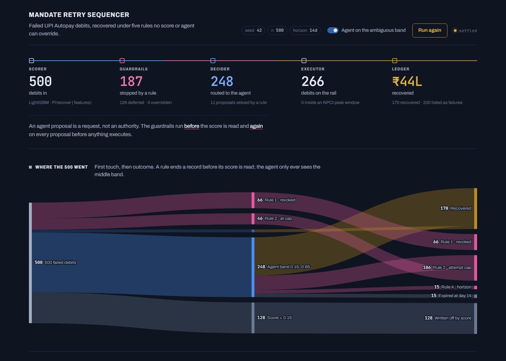

# Mandate Retry Sequencer

**A guardrailed recovery pipeline for failed UPI Autopay mandate debits — where an agent proposes
and compliance rules dispose.**

This project is an implementation of the "agent proposes, rules dispose" pattern — the same
governance architecture used in production AI systems for eCommerce and fintech. An ML model scores
each case for recoverability, an LLM agent handles the ambiguous middle, and five inviolable
compliance rules run before *and* after every agent proposal. No score, and no agent decision, can
override a hard rule. Every rupee the system touches is traceable to a row in an append-only
ledger, and everything it failed to recover is listed in full rather than hidden.

**Live:** [mandate-retry-frontend.onrender.com](https://mandate-retry-frontend.onrender.com) — runs
the batch on load (the free-tier backend takes up to a minute to wake the first time).

[](https://mandate-retry-frontend.onrender.com)

**More than 20 million UPI Autopay mandates are revoked every month in India because the customer's
balance was short.** Retrying them is not the hard part — every gateway does that. The hard part is
proving *which* retries were permitted, which were refused, what being wrong cost, and what the
system chose not to do.

> On the committed seed it recovers **₹44,25,090 of ₹1,26,32,606 at risk (35.0%)** across 500
> records: 187 stopped by a hard rule, 11 agent-proposed retries vetoed by one, **zero of 266 debits
> executed inside an NPCI peak window**, and ₹82,07,516 it failed to recover listed in full rather
> than hidden. **214 tests**, and a fresh clone with no API key reproduces every figure. The
> milestone history is in [SPEC.md](SPEC.md) §10.

### What it refuses to do

Five hard rules run **before** the score is read, and no score and no agent proposal may override
them. Rule 5 is the one worth pausing on:

| | IST |
|---|---|
| Autopay execution **permitted** | before 10:00 · 13:00–17:00 · after 21:30 |
| **Blocked** — NPCI peak hours | 10:00–13:00 · 17:00–21:30 |

Effective 1 August 2025, NPCI restricts non-customer-initiated APIs — which is what a mandate debit
is — to non-peak hours. That closes about 40% of the day. A retry falling inside a window is
deferred to the window edge, never executed and never dropped, and a test asserts the guarantee
across every debit in the run.

It is also the only constraint here checkable against a dated public source. Every other constant
is graded in [`policy.py`](backend/app/policy.py) as regulation, industry convention, or assumption
— and every external claim this repo makes is cited, tiered, and challenged in
[SOURCES.md](SOURCES.md), including what would change my mind.

---

## Run it

Requires [uv](https://docs.astral.sh/uv/) and Node 22+ (Vite 8). **No API key is needed.**

```bash
uv sync --extra dev                    # creates .venv on Python 3.12

# Generate the data. Both sets are needed and neither is committed - they are
# reproducible byte-for-byte from these two commands (SPEC 2.1).
.venv/Scripts/python -m backend.scripts.generate_data --seed 42   --n 500  --name batch
.venv/Scripts/python -m backend.scripts.generate_data --seed 1042 --n 8000 --name corpus --split

.venv/Scripts/python -m uvicorn backend.app.main:app --port 8000
```

The trained scorer (`models/scorer.txt`) **is committed**, so you do not need to train to run the
demo. To retrain it from the corpus and see the metrics:

```bash
.venv/Scripts/python -m backend.scripts.train_scorer --prove-seal
```

`--prove-seal` demonstrates that the holdout cannot be read before the model is fit - the guard
raises rather than quietly returning a better-looking number.

In a second terminal:

```bash
cd frontend && npm install && npm run dev              # http://localhost:5173
```

Open http://localhost:5173. The dashboard runs the batch on load and renders the rail: where the
500 debits went, each rule's fire count, a 24-hour clock proving no debit ran in an NPCI peak
window, the score band the agent is confined to, and every record it failed to recover.

On macOS or Linux, use `.venv/bin/python` in place of `.venv/Scripts/python`.

### Tests

```bash
.venv/Scripts/python -m pytest
```

### Ask why a record scored what it did

Select any row in the failures table, or:

```bash
curl -s localhost:8000/explain/mrs_805558
```

SHAP contributions in log-odds, plus a one-line summary. No API key needed — this is the
explanation layer that works in the ablation.

### Check the headline figure yourself

After a run, re-derive the total straight from the ledger. This script
deliberately does not import `ledger.py` - if it shared the aggregation code, agreement would be a
tautology rather than a check (SPEC 8.2 gate 2):

```bash
.venv/Scripts/python -m backend.scripts.verify_totals
```

### Deploy

[`render.yaml`](render.yaml) describes both services for [Render](https://render.com): a Python
web service that generates the data at build time and serves the API, and a static site for the
dashboard. The frontend reads the API origin from `VITE_API_URL` at build time
(see [`frontend/.env.example`](frontend/.env.example)); the backend accepts any `*.onrender.com`
origin plus localhost, and `CORS_ORIGINS` (comma-separated) adds more.

---

## Why there is no API key requirement

An LLM agent decides the ambiguous middle of the score distribution — the records where the model's
probability alone does not determine the right action. That would normally make results
irreproducible and lock the repo behind a key.

It does not here, because decisions resolve in three layers (SPEC §4.3):

1. **A committed response cache.** Every agent decision is stored in `cache/llm/`, keyed by a hash
   of the record, and committed. A clone with no key replays them and reproduces the numbers
   exactly. *It is empty in this checkout* — entries are only produced by a run with a key set, and
   the pipeline is fully functional without them. See `cache/llm/README.md`.
2. **A deterministic fallback policy.** Pure, tested, no network. Covers anything uncached.
3. **An ablation.** One command runs the pipeline with and without the agent and prints the rupee
   difference — the agent's *measured* contribution rather than a claim about it:

   ```bash
   .venv/Scripts/python -m backend.scripts.ablate
   ```

   With the cache empty and no key that delta is **₹0**, because both arms fall through to the same
   deterministic policy. The script says so explicitly rather than printing a zero that could be
   mistaken for a result. With a key set, `--populate` fills the cache first and the comparison
   becomes real.

---

## How it works

```
500 failed mandate debits
        │
        ▼
  [ SCORER ]      LightGBM · P(recover | features)
        │
        ▼
  [ GUARDRAILS ]  five hard rules, evaluated first and always
        │         revoked · attempt cap · cooling · horizon · NPCI peak window
        ▼
  [ DECIDER ]     agent, called only for the ambiguous band (0.15–0.65)
        │         proposes an action; the guardrails re-validate before execution
        ▼
  [ EXECUTOR ]    simulated rail, stepped over a 14-day clock
        │
        ▼
  [ LEDGER ]      append-only · input, score, rules fired, action, outcome, ₹
        │
        ▼
  [ DASHBOARD ]   the pipeline as the interface: where the 500 went, the
                  rulebook with live fire-counts, the NPCI 24h clock,
                  the decider's band · honest list of everything it failed to recover
```

A hard rule always beats the score, and always beats the agent. An agent proposal is a request, not
an authority — it is re-checked against rules 1–5 before anything executes.

Full design in [ARCHITECTURE.md](ARCHITECTURE.md). The contract this is built against is
[SPEC.md](SPEC.md), which is also where every design decision and every reversal is recorded.

---

## Honest notes

- **All data is synthetic**, generated in-repo by a seeded script. No real merchant data is used or
  needed.
- **The regulatory constants are graded, not uniformly trusted.** The attempt cap and the peak-hour
  windows are attributed to NPCI guidelines effective 1 Aug 2025 by multiple independent reports;
  the 24/72/168h retry ladder is industry convention rather than regulation; the 24h cooling period
  is an unsourced assumption. **Nothing was read from the primary circular** — `npci.org.in` blocks
  automated fetches — and [SOURCES.md](SOURCES.md) says so, tiers every claim, and lists what would
  change my mind.
- **The scorer is trained on data this repo generates**, so its AUC measures the pipeline, not a
  real-world result. The generator is deliberately built with an interaction the model must
  discover, genuine label noise, and one cohort it systematically gets wrong — see SPEC §2.2.
- **Defense-only.** Nothing in this repository is offense-capable.

## Licence

MIT
